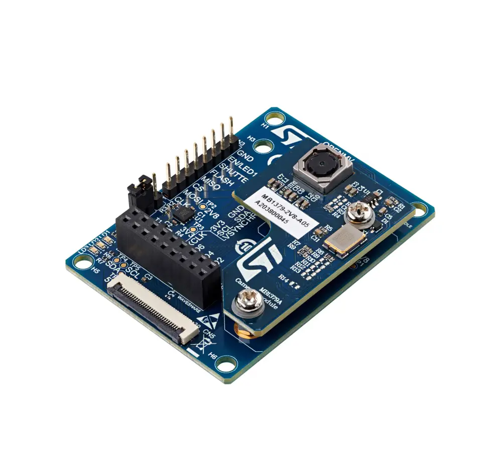

.. _st_b_cams_omv_mb1683:

ST B-CAMS-OMV-MB1683
####################

Overview
********

The camera module bundle (B-CAMS-OMV) provides extension connectors
for the MB1379 STMicroelectronics camera module daughterboard or
third-party modules like OpenMV and Waveshare modules. It can be used
with the STM32 boards featuring a 1 x 30 pin ZIF connector for the
connection of multiple cameras to implement computer vision on STM32
microcontrollers easily.

The camera module bundle is compatible with all STM32 Discovery kits and
Evaluation boards featuring a ZIF connector, such as the STM32H747I-DISCO,
STM32H7B3I-DK, and 32L4R9IDISCOVERY Discovery kits.

     B-CAMS-OMV MB1683 Image (Credit: STMicroelectronics.)

Waveshare camera board connector CN4
*************************************

+------------+-----------------+------------+--------------+
| Pin number | Description     | Pin number | Description  |
+============+=================+============+==============+
| 1          | GND             | 2          | VCAM         |
+------------+-----------------+------------+--------------+
| 3          | I2C_SDA         | 4          | I2C_SCL      |
+------------+-----------------+------------+--------------+
| 5          | DCMI_HSYNC      | 6          | DCMI_VSYNC   |
+------------+-----------------+------------+--------------+
| 7          | Camera_CLK      | 8          | DCMI_PIXCLK  |
+------------+-----------------+------------+--------------+
| 9          | DCMI_D6         | 10         | DCMI_D7      |
+------------+-----------------+------------+--------------+
| 11         | DCMI_D4         | 12         | DCMI_D5      |
+------------+-----------------+------------+--------------+
| 13         | DCMI_D2         | 14         | DCMI_D3      |
+------------+-----------------+------------+--------------+
| 15         | DCMI_D0         | 16         | DCMI_D1      |
+------------+-----------------+------------+--------------+
| 17         | PWR_EN / LED1   | 18         | RESET#       |
+------------+-----------------+------------+--------------+

ZIF connector CN5
*****************

+------------+--------------+------------+--------------+
| Pin number | Description  | Pin number | Description  |
+============+==============+============+==============+
| 1          | 3V3          | 16         | DCMI_PIXCK   |
+------------+--------------+------------+--------------+
| 2          | GND          | 17         | GND          |
+------------+--------------+------------+--------------+
| 3          | I2C_SCL      | 18         | SPI_MISO     |
+------------+--------------+------------+--------------+
| 4          | I2C_SDA      | 19         | SPI_CS       |
+------------+--------------+------------+--------------+
| 5          | RESET#       | 20         | DCMI_D7      |
+------------+--------------+------------+--------------+
| 6          | PWR_EN / LED1| 21         | DCMI_D6      |
+------------+--------------+------------+--------------+
| 7          | SHUTTER      | 22         | DCMI_D5      |
+------------+--------------+------------+--------------+
| 8          | GND          | 23         | DCMI_D4      |
+------------+--------------+------------+--------------+
| 9          | PULLDOWN / LED2 | 24      | DCMI_D3      |
+------------+--------------+------------+--------------+
| 10         | Camera_CLK   | 25         | DCMI_D2      |
+------------+--------------+------------+--------------+
| 11         | 3V3          | 26         | DCMI_D1      |
+------------+--------------+------------+--------------+
| 12         | DCMI_VSYNC   | 27         | DCMI_D0      |
+------------+--------------+------------+--------------+
| 13         | 5V (RSU)     | 28         | SPI_MOSI     |
+------------+--------------+------------+--------------+
| 14         | DCMI_HSYNC   | 29         | SPI_CLK      |
+------------+--------------+------------+--------------+
| 15         | GND          | 30         | GND          |
+------------+--------------+------------+--------------+

Requirements
************

Your board needs to have a ``dcmi`` device tree label to work with this shield.

Usage
*****

The shield can be used in any application by setting ``SHIELD`` to
``_st_b_cams_omv_mb1683`` and adding the necessary device tree properties.

Set ``--shield "_st_b_cams_omv_mb1683"`` when you invoke ``west build``. For example:

.. zephyr-app-commands::
   :zephyr-app: samples/drivers/video/capture_to_lvgl
   :board: stm32h7b3i_dk
   :shield: st_b_cams_omv_mb1683
   :goals: build

References
**********

- `Product page <https://www.st.com/en/evaluation-tools/b-cams-omv.html>`_

- `Databrief <https://www.st.com/resource/en/data_brief/b-cams-omv.pdf>`_

- `User manual <https://www.st.com/resource/en/user_manual/um2779-camera-module-bundle-for-stm32-boards-stmicroelectronics.pdf>`_
